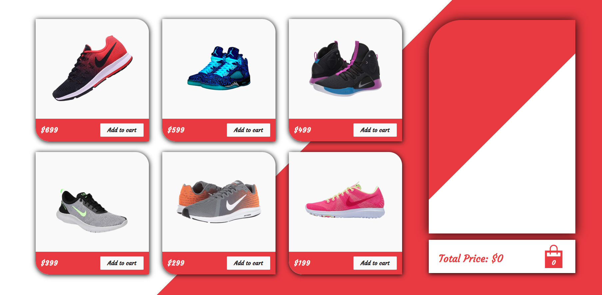
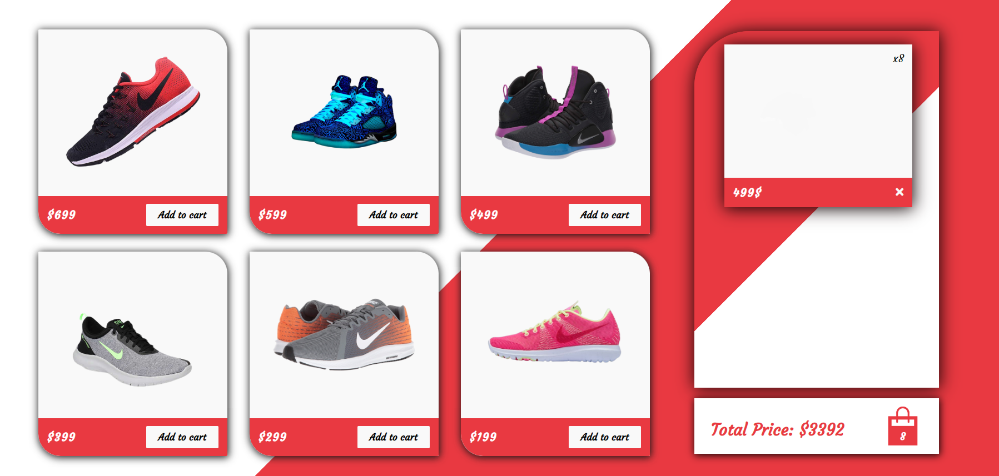

<h1 align="center">Redux Store</h1>

Module #22 - State

## 🎮 How to use
1. Add or remove as many pairs of the 6 shoe selections to your shopping cart.

## 🚀 Features
- Displays prices with "Add to cart" button.
- Total price and amount of items calculated on the side card.
- Can add multiple pairs of the same type of shoes.

## 🛠 Build setup
Clone or fork the repository

1. To start the application, type "npm start" in the terminal to run the server.

## Description
Created a shopping application using Redux and React.

## Usage
Live Demo link: https://react-shopping-cart-app.netlify.app/

## User Story
AS a senior engineer working on an e-commerce platform
I WANT my platform to use Redux to manage global state instead of the Context API
SO THAT my website's state management is taken out of the React ecosystem

## Acceptance Criteria
GIVEN an e-commerce platform that uses Redux to manage global state
WHEN I review the app’s store
THEN I find that the app uses a Redux store instead of the Context API
WHEN I review the way the React front end accesses the store
THEN I find that the app uses a Redux provider
WHEN I review the way the app determines changes to its global state
THEN I find that the app passes reducers to a Redux store instead of using the Context API
WHEN I review the way the app extracts state data from the store
THEN I find that the app uses Redux instead of the Context API
WHEN I review the way the app dispatches actions
THEN I find that the app uses Redux instead of the Context API

## Screenshots

